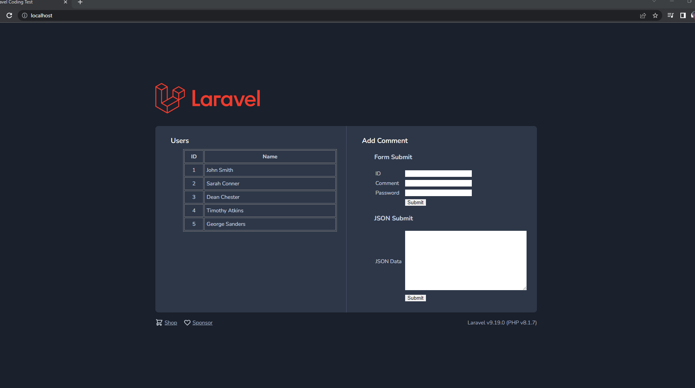

# Laravel Coding Test

This project was created to use as an evaluation source code.

## Prequisite

The project runs on docker container to ensure the right versions of php and postgres being used. Though it could still run on any independent servers having PHP 8.1 and PostgreSQL 14.4 it is advised to run on its container as the containers had already been configured.

<br/>

## How to Install
1. Clone the repository
2. Go inside the directory
3. Run the following on the command line:

    ```
    docker-compose up -d
    ```
4. Enter the php container's shell
    ```
    docker exec -it Laravel-Coding-Test_php bash
    ```
    <i>*Note: This is assumed that the `APP_NAME` on the `.env` file was not changed.</i>
5. Install the application via composer
    ```
    composer install
    ```
6. Migrate the database
    ```
    php artisan migrate
    ```
7. Seed the user data
    ```
    php artisan db:seed
    ```
8. Going to `http://localhost` should load the application

<br/>

## User Manual

### Using the Frontend
The application comes with a frontend to access the user lists and individual users. 
Also premade forms to do the Form and JSON submision  are already included on this pages

- <b>User List</b>

   This page is where the users are listed.
   It can be accessed via the home page of the app. (http://localhost)

   

   As seen on the image above, the list of users are on the left side placed in a table. 
   You may click on the ID or the Name to view the user page.


   On the right side is were the forms to submit data via form submission (having ID, Comment and Password fields).

   As well as the for to submit JSON data.

- <b>User Page</b>
    
    This page is where you can view users individually.
    This is also where the comments for each user is shown.

    

    On the left portion, you'll see the user's name as well as its comments.
    On the right is a form you could also use to submit comments.

    It will only need the comment and the password as tha page already supplies the ID as you are already viewing the user page.


### Using the CLI

Comments could also be added via the command line using php artisan.

The command to do so is as follows:

```
php artisan user:comment {ID} {Comment}
```

Replace the `{ID}` with the user ID, and `{Comment}` with the comment you wish to be appended.

In case you are unable to supply them, you will also be notified as it also had validations.

<i><b>*Important:</b> Make sure you are inside the containers CLI when doing this command. There is a chance it will cause an error if the versions of PHP or Composer version on your computer outside the container is not the same.

Or use docker exec if you dont want to enter the container:
```
docker exec Laravel-Coding-Test_php php artisan user:comment {ID} {Comment}
```
</i>

<br />

## Unit Testing

To do Unit Test, just run the following command inside the container shell:
```
php artisan test
```
or if outside
```
docker exec Laravel-Coding-Test_php php artisan test
```